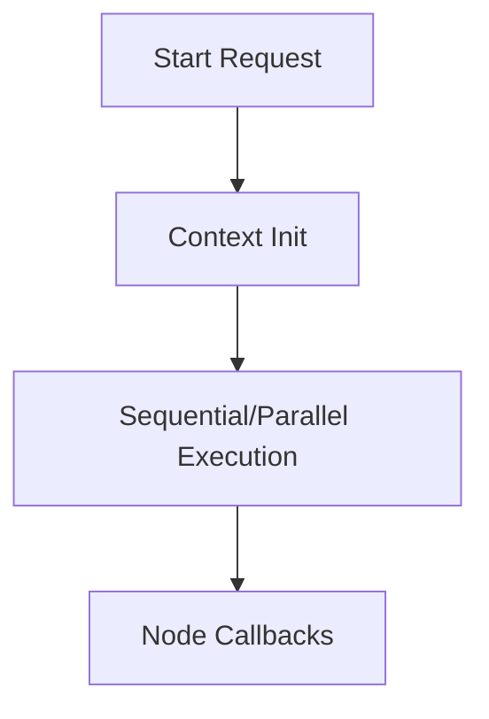

# BubbleLabs Workflow Execution Runtime

## Summary
The core engine that interprets visual workflow definitions and executes the individual "Bubble" nodes. It handles the lifecycle of a workflow run, including context initialization and parallel task execution.

## Core Flow

## Notable Gotchas & Tech Debt
- **Event Loop Blocking**: Long-running AI operations must be carefully offloaded to background workers to prevent blocking the Hono/Bun event loop.
- **Instance Management**: Uses a TTL-based eviction strategy for instances to prevent memory exhaustion over time.

[[bubblelabs.md]]
