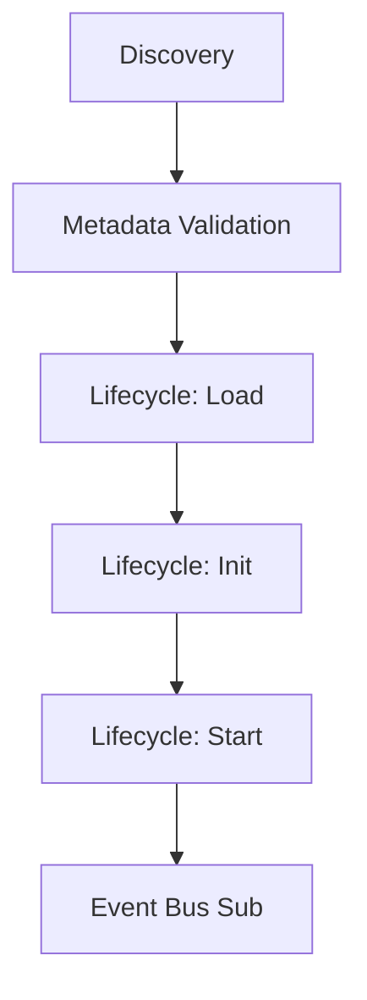

# BubbleLabs Plugin Architecture

## Summary
A modular extension system that allows isolated modules (e.g., LeanAide, Mitosis) to register custom visual nodes and specialized backend logic. It defines a formal lifecycle for plugins from discovery to shutdown.

## Core Flow

## Notable Gotchas & Tech Debt
- **Shutdown Order**: Plugins must be shut down in reverse-dependency order to avoid dangling resources or memory leaks.
- **Plugin Isolation**: Ensuring that one faulty plugin doesn't crash the entire BubbleLabs runtime is an ongoing challenge.

[[bubblelabs.md]]
