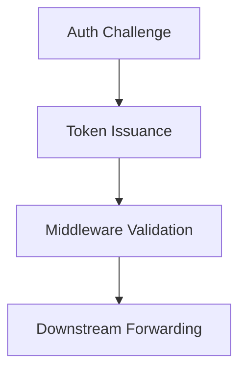

# BubbleLabs Security & Hardening

## Summary
Responsible for identity management (Clerk/JWT), Role-Based Access Control (RBAC), and the secure management of API credentials. It ensures that only authorized users can design or execute workflows.

## Core Flow

## Notable Gotchas & Tech Debt
- **Token Management**: Handling token rotation and expiry mid-workflow is critical to prevent sudden execution failures.
- **RBAC Granularity**: Mapping fine-grained Python permissions to frontend UI capabilities is an ongoing integration task.

[[bubblelabs.md]]
