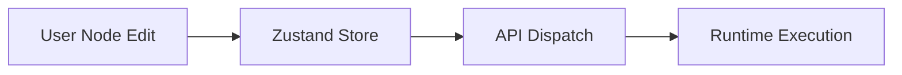

# BubbleLabs Visualization Layer (Flow Studio)

## Summary
The React-based frontend application that uses `ReactFlow` to provide a drag-and-drop workflow designer. It allows users to visually compose agent tasks and monitor their progress in real-time.

## Core Flow

## Notable Gotchas & Tech Debt
- **Real-time Sync**: Synchronizing the complex frontend graph state with asynchronous backend execution requires robust handling of WebSockets and polling fallbacks.
- **Node Performance**: Large graphs with many custom visual components can lead to UI latency on lower-end hardware.

[[bubblelabs.md]]
