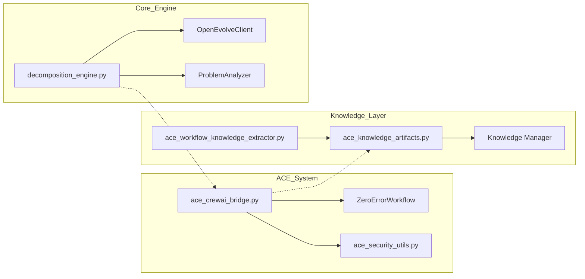

# Confirmed Analysis of Voicetree Project Structure

## Detailed verification of the OpenEvolve Frontend codebase modules

I have verified the initial analysis by deep-diving into key implementation files. The codebase demonstrates a high level of maturity with strong emphasis on security, modularity, and licensing compliance.

Key findings from in-depth analysis:

- **ACE Bridge Evolution**: Verified that `ace_crewai_bridge.py` explicitly replaces the Hephaestus integration to move from AGPL to MIT license, utilizing `ZeroErrorWorkflow`.
- **Sovereign-Grade Decomposition**: Confirmed `decomposition_engine.py` implements a sophisticated semantic decomposition strategy using LLMs with robust fallback mechanisms and integration with `OpenEvolveClient`.
- **Knowledge Management Sophistication**: `ace_knowledge_artifacts.py` defines a rich set of `ArtifactType` (Solution Patterns, Anti-Patterns, etc.) and `ArtifactSource` to capture learning from across the system.
- **Security-First Architecture**: `ace_security_utils.py` provides a centralized suite of validation tools (path resolution, JSON safety, numeric ranges) that are consistently imported across all major modules.

## Architectural Flow

### NOTES
The system's architectural integrity is maintained through strict validation layers (ACE Security Utils) and a clear separation between decomposition logic and execution orchestration (CrewAI Bridge). The transition to MIT-licensed components (CrewAI) indicates a strategic move towards a more permissive and commercially friendly codebase.

Complexity Score: 8/10. The codebase uses advanced Python patterns (decorators, abstract base classes, complex dataclasses) and integrates multiple external AI frameworks.

documented progress for [[C:/Users/mmeadow/Documents/OpenEvolve/Frontend/voicetree-1-2/analyzing_voicetree_project_progress.md]]
