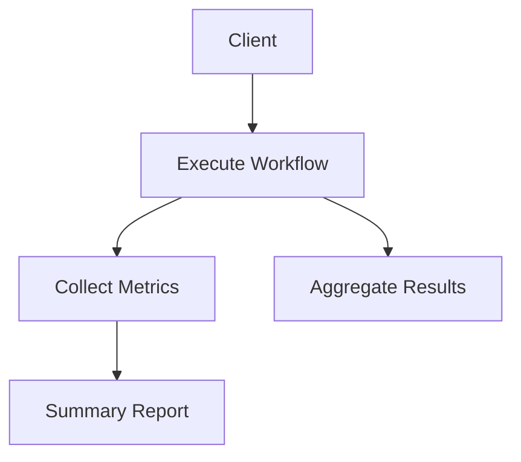

# CrewAI Client & Metrics Interface

## Summary
The primary developer-facing interface for interacting with the CrewAI module. it provides high-level methods for execution and monitoring, and automatically collects metrics (token usage, time, success rates) for every workflow run.

## Core Flow

## Notable Gotchas & Tech Debt
- **Synchronous Collection**: Metrics collection is currently synchronous, which can add latency to very fast tasks.
- **Aggregation Limits**: Logic for result aggregation (e.g., First-to-Ahead voting) is sometimes tightly coupled with specific agent types.

[[crewai_integration_layer.md]]
