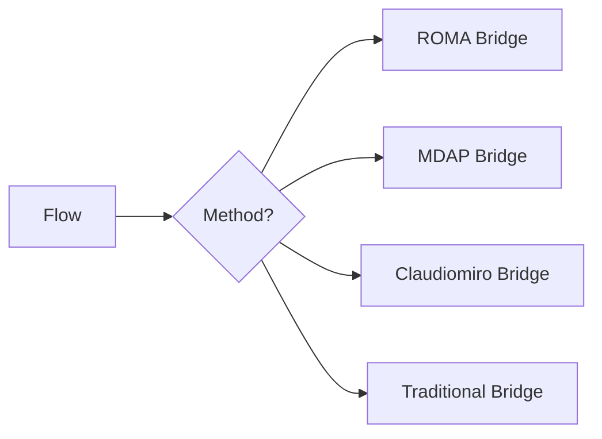

# CrewAI Execution Method Adapters (Bridges)

## Summary
A collection of specialized adapters that bridge the unified flow to different solving strategies. This includes ROMA for recursive planning, MDAP for voting-based consensus, and Claudiomiro for CLI-based agent interaction.

## Core Flow

## Notable Gotchas & Tech Debt
- **Configuration Variance**: Each bridge has its own configuration schema, leading to inconsistent validation logic across the integration layer.
- **Dependency Isolation**: Bridges often depend on external libraries that may not be available in all deployment scenarios.

[[crewai_integration_layer.md]]
