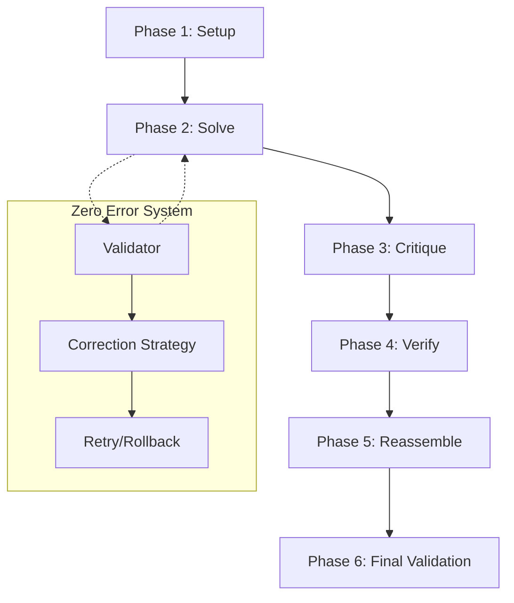

# CrewAI Integration Layer

## Summary
The CrewAI Integration Layer provides a unified interface for orchestrating multi-agent "crews" using the CrewAI framework. It manages the standard 6-phase workflow (Setup, Solve, Critique, Verify, Reassemble, Validate) and includes a "Zero Error Workflow" system for high-reliability task execution with built-in retries and error correction.

## Core Flow

## Notable Gotchas & Tech Debt
- **Legacy Bridges**: Multiple bridge implementations (`CrewAIUnifiedBridge`, `ACECrewAIWorkflowBridge`) exist for backward compatibility with the older Hephaestus system, creating some redundant code.
- **Distributed State**: Managing state across distributed agents can lead to consistency issues if the `StateManager` is not used rigorously.
- **Complexity of Phase 2**: The "Solve" phase often branches out into MDAP or MAKER sub-workflows, which can be difficult to trace in logs.

[[run_me.md]]
