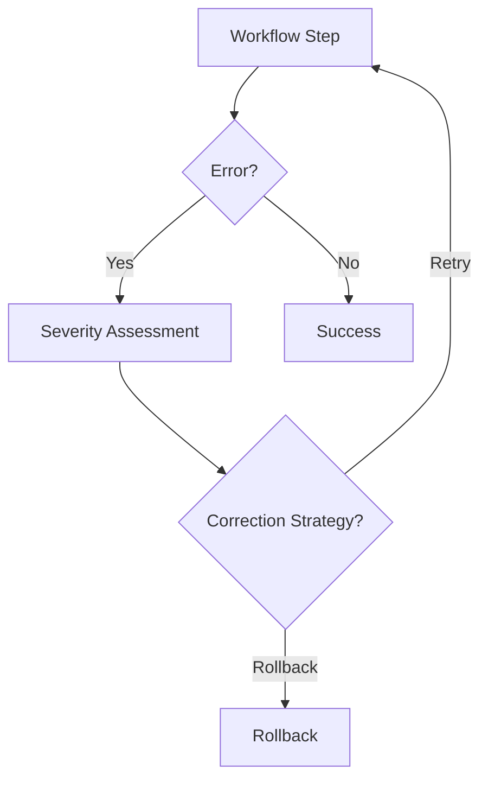

# CrewAI Reliability & Zero-Error Engine

## Summary
A reliability-focused component that wraps workflow steps with error detection and auto-correction logic. It monitors for common failures (timeouts, validation errors, resource issues) and applies mitigation strategies like exponential backoff and parameter adjustment.

## Core Flow

## Notable Gotchas & Tech Debt
- **Hardcoded Logic**: Many correction strategies are currently hardcoded, making it difficult to adapt to new types of errors.
- **Root Cause Masking**: Aggressive auto-correction can sometimes hide underlying infrastructure problems that should be addressed directly.

[[crewai_integration_layer.md]]
