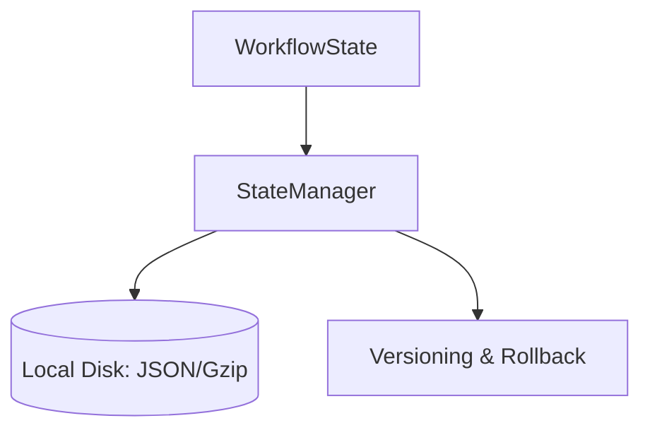

# CrewAI State & Persistence Manager

## Summary
The persistence layer for CrewAI workflows. it uses type-safe Pydantic models to represent the workflow state and supports saving/loading from local storage (JSON/Gzip). it includes features for versioning, snapshotting, and rolling back state.

## Core Flow

## Notable Gotchas & Tech Debt
- **Concurrency Risks**: Currently lacks robust file-locking mechanisms, which can lead to state corruption if multiple processes attempt to write to the same workflow ID.
- **Migration Path**: Schema changes in Pydantic models require manual migration of older persisted state files.

[[crewai_integration_layer.md]]
