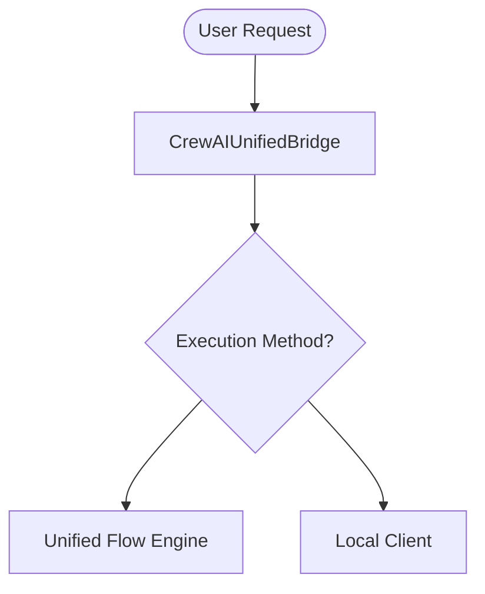

# CrewAI Unified Bridge Layer

## Summary
The primary API entry point and legacy compatibility facade for the CrewAI module. it handles the transition from older API-based execution to the new local, event-driven architecture, mapping external requests to internal execution methods.

## Core Flow

## Notable Gotchas & Tech Debt
- **Lazy Imports**: Extensive use of 'lazy-bridge' pattern with optional imports can hide environment configuration issues until runtime.
- **Redundancy**: Overlap between `CrewAIUnifiedBridge` and `ACECrewAIWorkflowBridge` needs consolidation.

[[crewai_integration_layer.md]]
