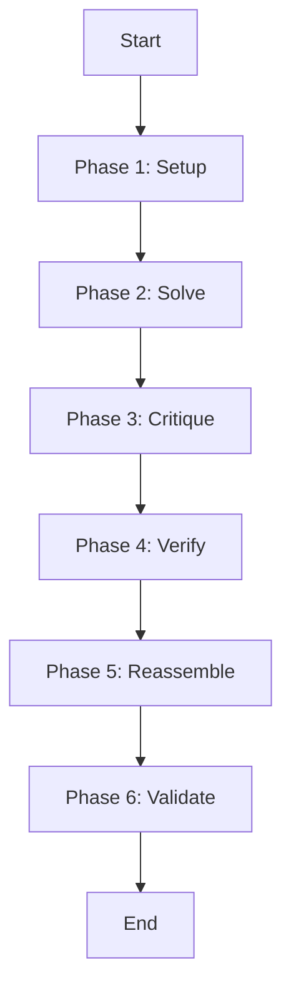

# CrewAI Workflow Orchestration Engine (Unified Flow)

## Summary
The core engine that implements the 6-phase evolutionary lifecycle (Setup, Solve, Critique, Verify, Reassemble, Validate). It uses an event-driven "Flow" architecture to manage the transition between phases and coordinate agent activities.

## Core Flow

## Notable Gotchas & Tech Debt
- **State Consistency**: Ensuring that state is correctly preserved and migrated across different execution methods (e.g., Traditional vs. ROMA) is highly complex.
- **Event Debugging**: Tracing the flow of events across multiple asynchronous phases can be difficult with standard logging.

[[crewai_integration_layer.md]]
