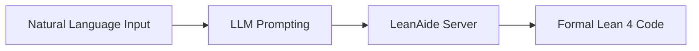

# LeanAide Autoformalization & Translation Engine

## Summary
The "entry point" for mathematical problems. it uses Large Language Models to convert informal natural language statements into formal Lean 4 declarations and definitions. This process is critical for establishing the goal state for subsequent proof search.

## Core Flow

## Notable Gotchas & Tech Debt
- **Semantic Drift**: A high risk that the formal code produced is type-correct but mathematically different from the user's original natural language intent.
- **Ambiguity Handling**: Natural language is often ambiguous; the engine must make assumptions that may not always be correct.

[[leanaide_formal_verification.md]]
