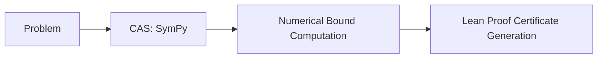

# LeanAide Continuous Mathematics Bridge

## Summary
A specialized component that connects formal verification with numerical and symbolic computation for analysis tasks (e.g., integrals, ODEs). It uses Computer Algebra Systems (CAS) like SymPy to compute bounds and then generates formal Lean certificates for those bounds.

## Core Flow

## Notable Gotchas & Tech Debt
- **Numerical Instability**: Inaccuracies in the underlying CAS can lead to the generation of unprovable certificates if the calculated bounds are too tight.
- **Limited Scope**: Currently only supports a subset of analysis problems; expanding to more general continuous math is complex.

[[leanaide_formal_verification.md]]
