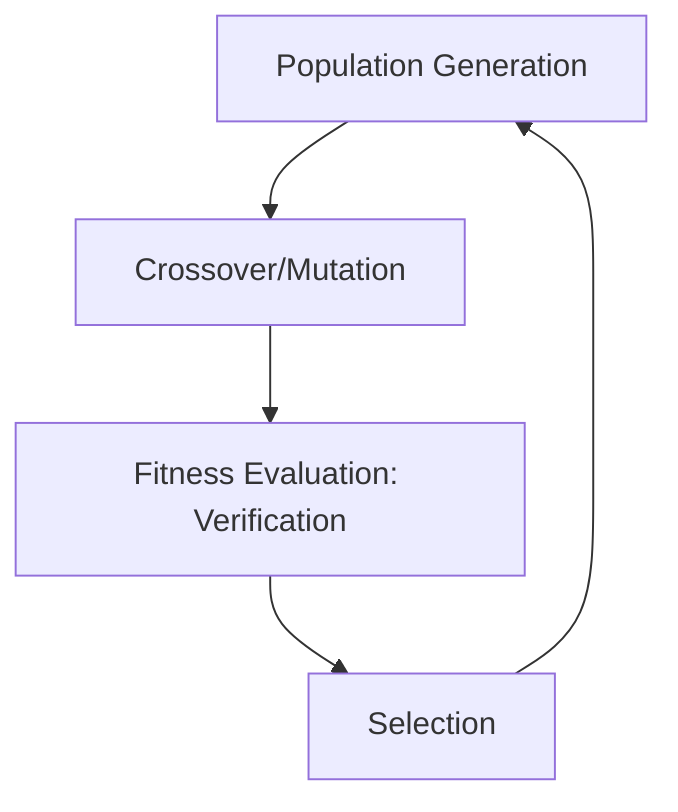

# LeanAide Evolutionary Strategy Generator

## Summary
An optimization component that uses genetic algorithms to evolve tactic sequences. It maintains a population of proof candidates and applies crossover and mutation operations to find increasingly "fit" proofs that satisfy the verifier.

## Core Flow

## Notable Gotchas & Tech Debt
- **Computational Cost**: Evolution is resource-intensive, as every new candidate in the population must be formally verified.
- **Local Optima**: The process can get stuck on proofs that are "almost" correct but require a completely different tactical path.

[[leanaide_formal_verification.md]]
