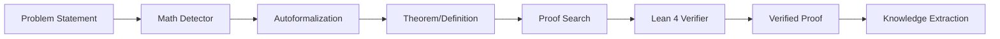

# LeanAide / Formal Verification

## Summary
LeanAide acts as a bridge between natural language mathematical problems and formal verification engines like Lean 4 and Z3. It employs autoformalization to convert informal statements into Lean code, then uses search strategies (MCTS, MDAP, Evolution) to find proofs, and finally verifies them using the formal prover.

## Core Flow

## Notable Gotchas & Tech Debt
- **Prover Timeouts**: Formal verification is computationally intensive; proof search and verification often hit hard timeouts.
- **Autoformalization Fidelity**: Large Language Models (LLMs) may produce Lean code that is syntactically correct but semantically different from the original natural language statement.
- **Dependency on Local Lean 4**: Requires a local Lean 4 installation and Mathlib, which makes environment setup complex.

[[run_me.md]]
