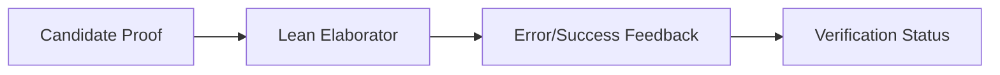

# LeanAide Formal Verification & Elaborator Interface

## Summary
The final validation layer that interacts with the Lean 4 compiler and elaborator. It submits proof candidates to the local Lean 4 environment and processes the feedback (errors or success) to confirm if a proof is logically sound.

## Core Flow

## Notable Gotchas & Tech Debt
- **False Positives**: The presence of `sorry` tokens in generated code can lead to "successful" verification if they are not explicitly purged.
- **Environment Setup**: Deeply dependent on a correctly configured local Lean 4 and Mathlib environment, which is difficult to automate.

[[leanaide_formal_verification.md]]
