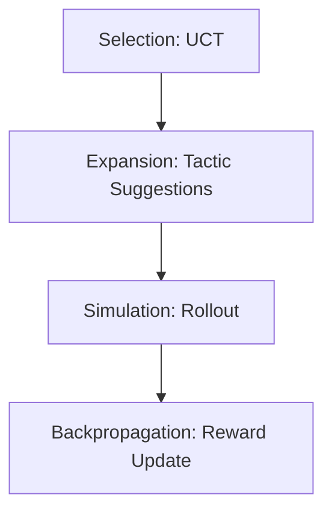

# LeanAide MCTS Proof Search Engine

## Summary
A search-based component that uses Monte Carlo Tree Search to explore the vast space of Lean tactics. It aims to find a sequence of tactics that transforms the theorem statement into a complete proof.

## Core Flow

## Notable Gotchas & Tech Debt
- **Tactic Explosion**: The search space for proofs is enormous; without effective pruning or "progressive widening," the search tree can become unmanageably wide.
- **Reward Shaping**: Defining accurate rewards for partial proofs is difficult and significantly impacts search effectiveness.

[[leanaide_formal_verification.md]]
