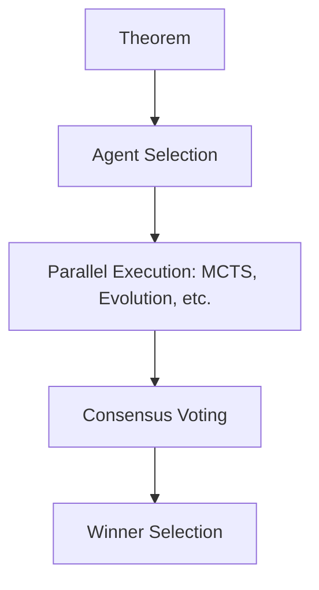

# LeanAide MDAP Orchestration Layer

## Summary
The central hub for coordinating multiple proof generation strategies. It enables parallel execution of different agents (MCTS, Evolution, etc.) and uses a voting-based consensus mechanism to select the most promising proof candidate.

## Core Flow

## Notable Gotchas & Tech Debt
- **Canonicalization**: Robustly aggregating votes requires 'canonicalizing' Lean code so that syntactically different but semantically identical proofs are counted correctly.
- **Vote Weights**: Determining the correct weight for different agent types in the consensus process is an ongoing tuning challenge.

[[leanaide_formal_verification.md]]
