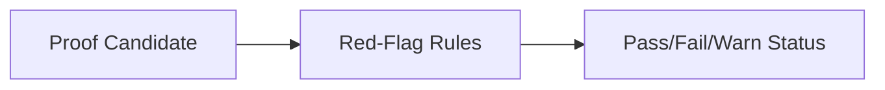

# LeanAide Red-Flagging & Security System

## Summary
A security and quality-of-service layer that filters proof candidates. It uses pattern matching and complexity analysis to identify invalid, unpromising, or potentially malicious code before it reaches the expensive verification stage.

## Core Flow

## Notable Gotchas & Tech Debt
- **False Flags**: Complex or highly innovative proof structures might be flagged as "suspicious" even if they are mathematically valid.
- **Rule Evolution**: As models become better at bypasses, the red-flagging rules must be constantly updated.

[[leanaide_formal_verification.md]]
