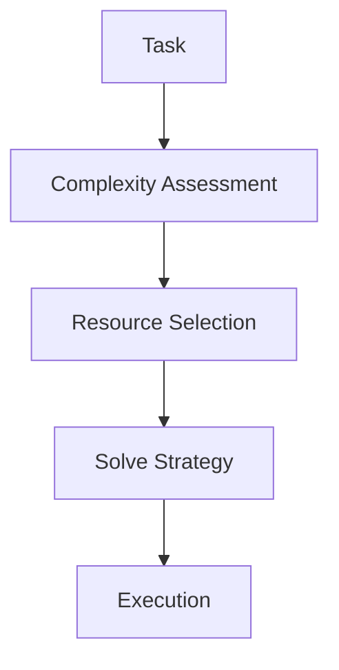

# MDAP Adaptive Resource Allocator

## Summary
A performance optimizer that dynamically matches agent resources to task complexity. It ensures that "easy" tasks use cheaper models and fewer voting rounds, while "critical" tasks are allocated high-performance models and larger voting ensembles.

## Core Flow

## Notable Gotchas & Tech Debt
- **Complexity Misjudgment**: If the allocator underestimates task complexity, it may assign insufficient resources, leading to failure in early rounds.
- **Budgeting Logic**: The cost-optimizing heuristics are often based on static rules rather than real-time budget tracking.

[[mdap_multi_dimensional_agentic_processing.md]]
