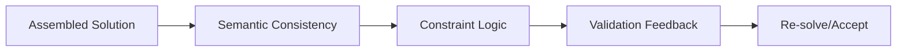

# MDAP Associative Validation Layer

## Summary
The post-assembly verification component. Once atomic solutions are reassembled, this layer performs "associative" checks to ensure that the integrated result is logically consistent and satisfies the original problem constraints.

## Core Flow

## Notable Gotchas & Tech Debt
- **Integration Errors**: Often, individual sub-solutions are correct, but the "glue" code generated during assembly is faulty.
- **Verification Fatigue**: Repeatedly validating similar assembled results can lead to decreased agent performance due to repetitive tasks.

[[mdap_multi_dimensional_agentic_processing.md]]
