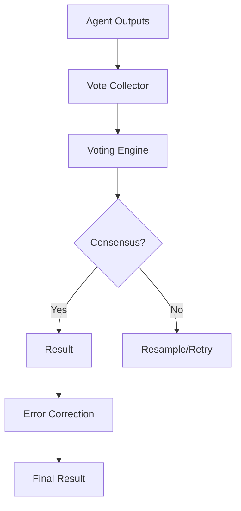

# MDAP MAKER Voting & Error Correction

## Summary
Implements the core consensus logic of the MAKER (Multi-Agent voting for KEeping Reliability) framework. it uses a "first-to-ahead-by-k" voting strategy to select the best agent output and applies automated correction for minor formatting or structural errors.

## Core Flow

## Notable Gotchas & Tech Debt
- **Convergence Time**: For highly complex or ambiguous tasks, the voting engine may require many rounds to reach consensus, leading to high token costs.
- **Vote Spreading**: If agents produce many different but equally valid outputs, the voting system might fail to select a winner without a sophisticated canonicalization layer.

[[mdap_multi_dimensional_agentic_processing.md]]
