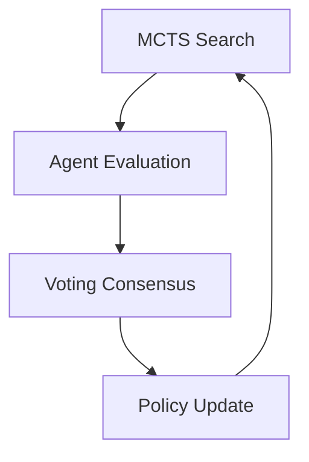

# MDAP MCTS Unified Framework

## Summary
The bridge between search-based methods (MCTS) and multi-agent evaluation (MDAP). it allows MDAP agents to evaluate nodes during the MCTS process and uses MCTS results to inform agent voting, creating a robust "best-of-both-worlds" solver.

## Core Flow

## Notable Gotchas & Tech Debt
- **High Latency**: Combining search and multi-agent voting is extremely slow compared to single-shot LLM calls.
- **Tuning Complexity**: Balancing the exploration constant of MCTS with the consensus thresholds of MDAP requires delicate hyperparameter tuning.

[[mdap_multi_dimensional_agentic_processing.md]]
