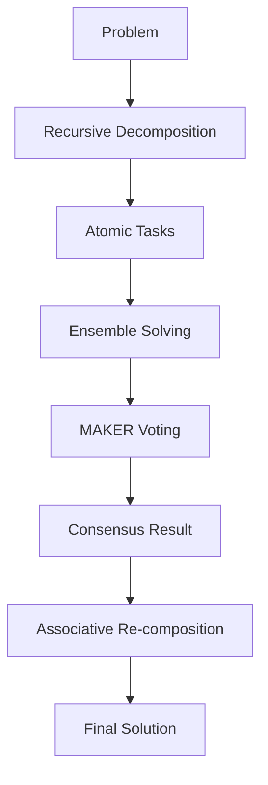

# MDAP (Multi-Dimensional Agentic Processing)

## Summary
MDAP is a robust problem-solving framework that utilizes recursive task decomposition and multi-agent voting (MAKER) to achieve high reliability. It breaks complex problems down into atomic tasks, solves them using an ensemble of agents, and then uses associative re-composition to assemble the final result.

## Core Flow

## Notable Gotchas & Tech Debt
- **Recursion Depth**: Deep recursive decomposition can lead to "task fragmentation" where context is lost between levels.
- **Voting Convergence**: The "First-K-Ahead" voting strategy may fail to converge if agents have high disagreement, leading to excessive sampling.
- **Aggregation Logic**: `_weighted_average_aggregation` and other consensus methods need careful tuning of agent weights.

[[run_me.md]]
