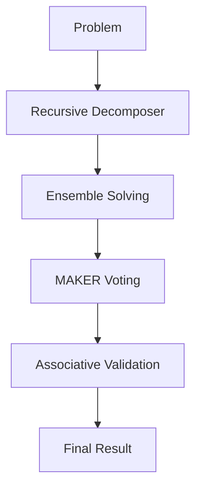

# MDAP Orchestration Engine

## Summary
The root controller of the Multi-Dimensional Agentic Processing framework. It coordinates the overall workflow from initial problem receipt to final reassembled result, managing high-level task state and triggering sub-components as needed.

## Core Flow

## Notable Gotchas & Tech Debt
- **Centralized Logic**: The orchestrator is a "fat" controller; some logic for specific problem domains should be offloaded to specialized plugins.
- **State Serialization**: The `MDAPCache` handles serialization of large task objects, which can become a bottleneck under heavy load.

[[mdap_multi_dimensional_agentic_processing.md]]
