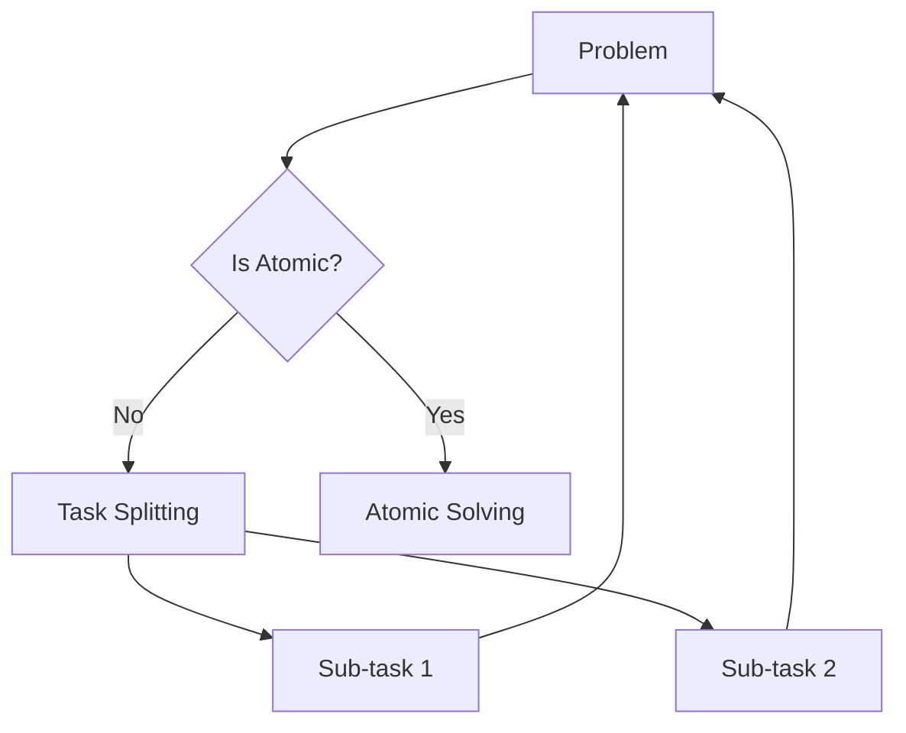

# MDAP Recursive Task Decomposer

## Summary
A fundamental component that breaks complex, multi-dimensional problems into smaller, atomic tasks using a binary or n-ary splitting strategy. This decomposition allows the system to tackle "intractable" problems by solving manageable pieces in parallel.

## Core Flow

## Notable Gotchas & Tech Debt
- **Context Loss**: Information can be lost during the splitting process, making it difficult for agents at the "leaves" of the tree to understand the overarching goal.
- **Fragmentation**: Over-decomposing can lead to "micro-tasks" that are too small to be solved effectively in isolation.

[[mdap_multi_dimensional_agentic_processing.md]]
