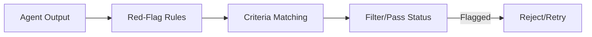

# MDAP Red-Flagging Engine

## Summary
The primary safety and quality filter for the MDAP framework. it uses a library of "red flag rules" to scan agent outputs for common failures (e.g., "sorry" tokens, logic loops, or schema violations) before they are passed to the voting engine.

## Core Flow

## Notable Gotchas & Tech Debt
- **False Negatives**: Subtle logic errors can easily bypass simple pattern-based red-flagging rules.
- **Performance Burden**: Running deep semantic checks on every agent sample can significantly increase total execution time.

[[mdap_multi_dimensional_agentic_processing.md]]
