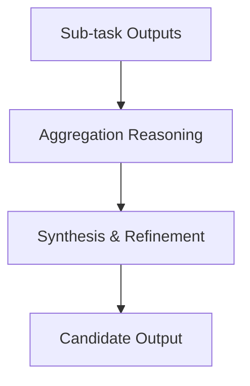

# ROMA Aggregator

## Summary
The synthesis engine that merges multiple sub-task outputs into a coherent response for the parent goal. It ensures that the aggregated result is not just a concatenation but a logically integrated whole that satisfies the original intent.

## Core Flow

## Notable Gotchas & Tech Debt
- **Context Overload**: Aggregating outputs from many sub-tasks can exceed the input context limit of the aggregator model.
- **Inconsistency Handling**: Different sub-tasks may produce contradictory findings that the aggregator must reconcile or flag.

[[roma_reasoning_on_multi_agent.md]]
