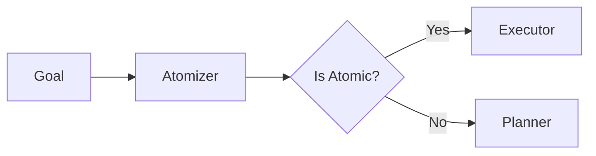

# ROMA Atomizer

## Summary
The primary decision engine at the top of the ROMA recursive loop. it evaluates whether a given goal is "atomic" (immediately executable via tools) or requires further decomposition by the Planner. This prevents unnecessary planning for simple tasks.

## Core Flow

## Notable Gotchas & Tech Debt
- **False Atomicity**: Misclassifying a complex task as atomic can lead to executor failure or shallow, incomplete results.
- **Decision Latency**: Every level of recursion starts with an atomizer call, which can add significant overhead to multi-level tasks.

[[roma_reasoning_on_multi_agent.md]]
