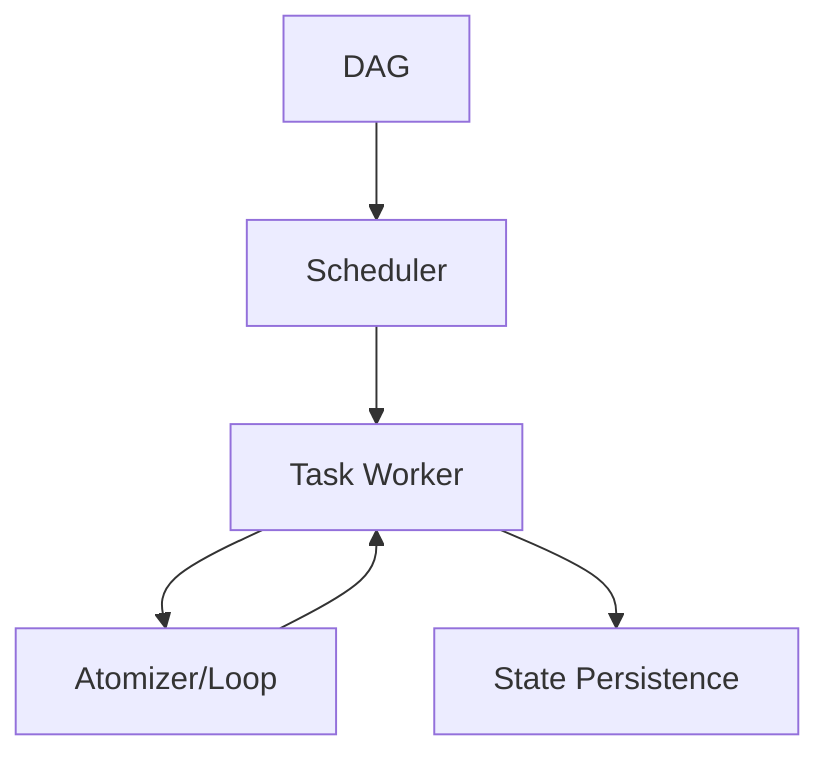

# ROMA Execution Engine (DAG/Scheduler)

## Summary
The orchestration layer that manages the entire recursive lifecycle. it handles the scheduling of tasks within a DAG, manages parallel execution where possible, and ensures that the state of each task is persisted for potential recovery or debugging.

## Core Flow

## Notable Gotchas & Tech Debt
- **Parallel Bottlenecks**: Dependencies between tasks often limit the actual amount of parallelism that can be achieved.
- **State Bloat**: Storing the full history and state of every recursive level can lead to significant disk space usage for long-running goals.

[[roma_reasoning_on_multi_agent.md]]
