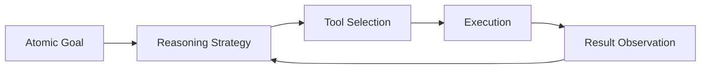

# ROMA Executor

## Summary
The processing unit responsible for executing atomic goals. It leverages various toolkits via ReAct (Reasoning and Acting) or CodeAct (executing code) strategies to interact with the environment and produce results.

## Core Flow

## Notable Gotchas & Tech Debt
- **Tool Hallucination**: Agents may attempt to use tools that are not in the current toolkit or pass incorrect parameters.
- **Safety Sandbox**: Executing arbitrary code via CodeAct requires a strictly isolated sandbox to prevent system-level impact.

[[roma_reasoning_on_multi_agent.md]]
