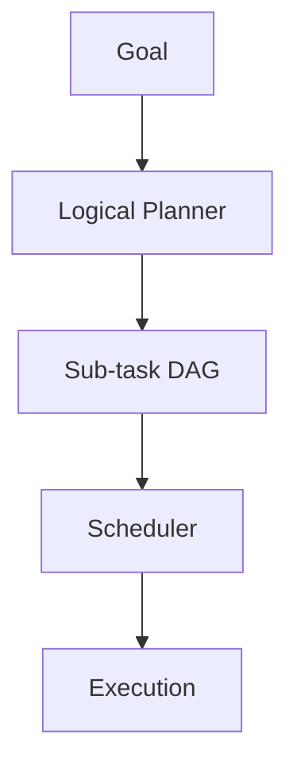

# ROMA Planner

## Summary
The decomposition engine of the ROMA framework. it breaks down non-atomic goals into a dependency-aware Directed Acyclic Graph (DAG) of sub-tasks. It uses specialized DSPy signatures to ensure that the plan is logically sound and comprehensive.

## Core Flow

## Notable Gotchas & Tech Debt
- **DAG Complexity**: Highly complex goals can result in deeply nested or wide DAGs that are difficult for the scheduler to manage efficiently.
- **Dependency Tracking**: Failing to identify a critical dependency between sub-tasks can lead to execution errors in later stages.

[[roma_reasoning_on_multi_agent.md]]
