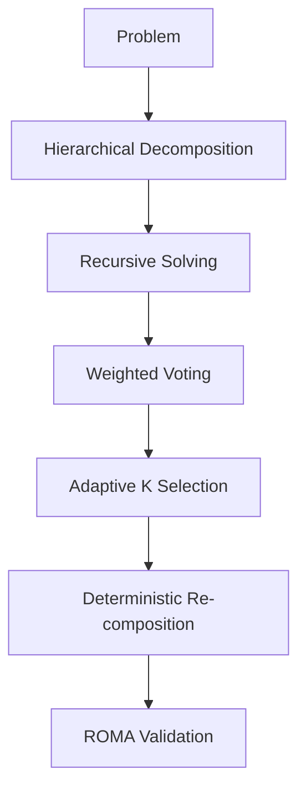

# ROMA (Reasoning On Multi-Agent)

## Summary
ROMA is an advanced reasoning engine that enhances the MDAP/MAKER framework with domain-aware logic and hierarchical processing. It provides structured decomposition for specific domains (physics, math, CS) and uses hierarchical voting to ensure that lower-level atomic solutions align with higher-level goal requirements.

## Core Flow

## Notable Gotchas & Tech Debt
- **Domain Rule Complexity**: The domain-specific rules for physics and mathematics are complex and require frequent updates to keep pace with state-of-the-art models.
- **Adaptive K Selection**: The logic for `AdaptiveKSelector` is based on empirical metrics that may not generalize well to all problem types.
- **Integration with OpenEvolve**: Uses its own set of "native" configs (`CREWAIROMAConfig`) which need to be mapped to the standard OpenEvolve parameters.

[[run_me.md]]
