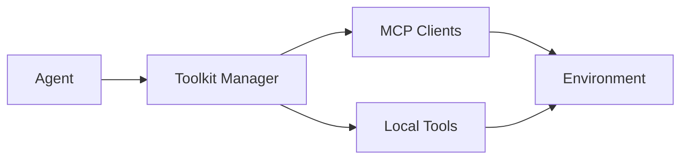

# ROMA Toolkit & Tool Management

## Summary
The capability provider for the ROMA framework. it manages the bridge between agents and external systems (e.g., Google Search, local file system, code interpreters) via the Model Context Protocol (MCP) and local toolkits.

## Core Flow

## Notable Gotchas & Tech Debt
- **Registry Fragmentation**: Tools are registered in multiple places across the codebase, making it difficult to maintain a single source of truth for agent capabilities.
- **MCP Versioning**: Changes in the MCP protocol or server implementations can break existing tool definitions.

[[roma_reasoning_on_multi_agent.md]]
