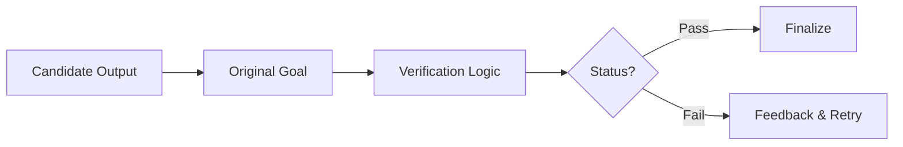

# ROMA Verifier

## Summary
The Quality Assurance module of the ROMA loop. it validates whether the candidate output (from an Executor or Aggregator) actually satisfies the original goal. if validation fails, it provides detailed feedback to trigger re-planning or re-execution.

## Core Flow

## Notable Gotchas & Tech Debt
- **Shallow Verification**: The verifier may perform a superficial check that misses deeper logical or technical inaccuracies.
- **Verification-Execution Loops**: Faulty goals or inadequate toolkits can lead to infinite loops between execution and failed verification.

[[roma_reasoning_on_multi_agent.md]]
