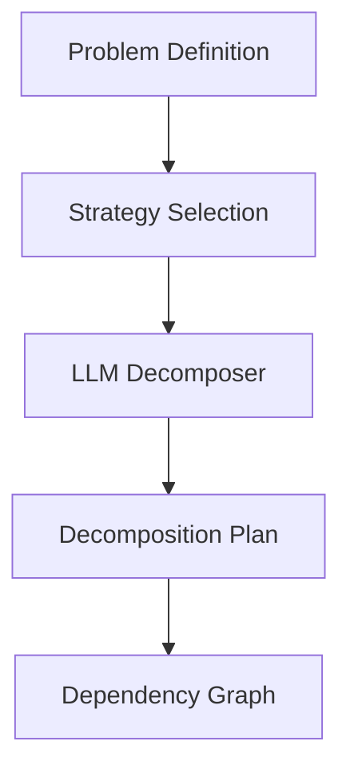

# Sovereign Decomposition Engine

## Summary
Responsible for splitting the primary problem into smaller, interdependent sub-problems. It supports multiple strategies, including Semantic (meaning-based), Dependency (logical flow), and Complexity-balanced, to ensure that the resulting tasks are well-sized for agent execution.

## Core Flow

## Notable Gotchas & Tech Debt
- **Dependency Loss**: Purely semantic decomposition can sometimes overlook critical logical dependencies between sub-tasks.
- **Over-splitting**: The engine can occasionally create too many trivial sub-problems, increasing orchestration overhead without improving solution quality.

[[sovereign_system.md]]
