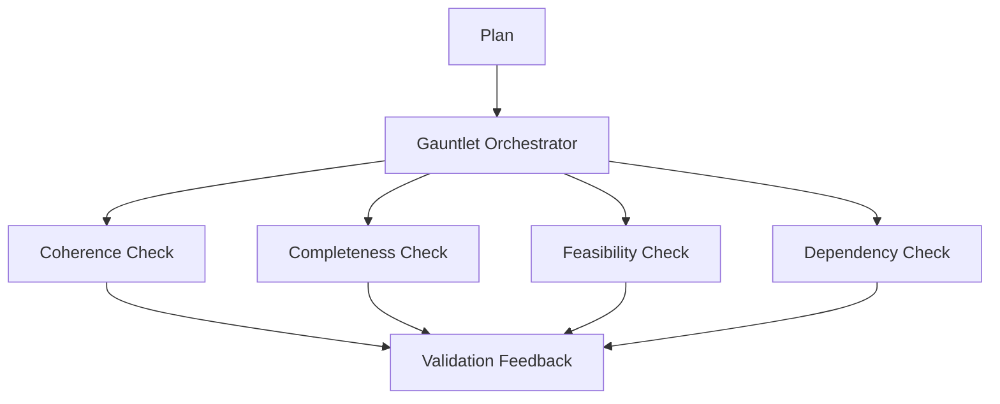

# Sovereign Gauntlet Validation System

## Summary
A rigorous automated testing layer that subjects every decomposition plan to a series of specialized "gauntlets": Coherence, Completeness, Feasibility, and Dependency checks. This ensures high structural quality before any solving begins.

## Core Flow

## Notable Gotchas & Tech Debt
- **Token Limits**: For very large plans (>10 sub-problems), the system often switches to "shallow" heuristic checks to avoid LLM token limits and high latency.
- **False Alarms**: Strict feasibility checks can sometimes flag valid but highly innovative plans as "unfeasible."

[[sovereign_system.md]]
