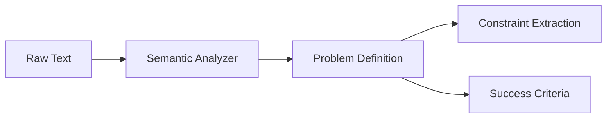

# Sovereign Problem Analysis

## Summary
The "intake" component of the Sovereign System. it performs deep semantic analysis on raw problem text to extract key metadata, including problem type, domain classification, and measurable success criteria. This structured definition forms the foundation for all subsequent steps.

## Core Flow

## Notable Gotchas & Tech Debt
- **Vague Input Weakness**: Highly ambiguous problem statements often result in "General" classification, which leads to suboptimal decomposition strategies.
- **Goal Drift**: The analyzer may misinterpret the user's primary goal, causing the entire workflow to focus on the wrong problem.

[[sovereign_system.md]]
