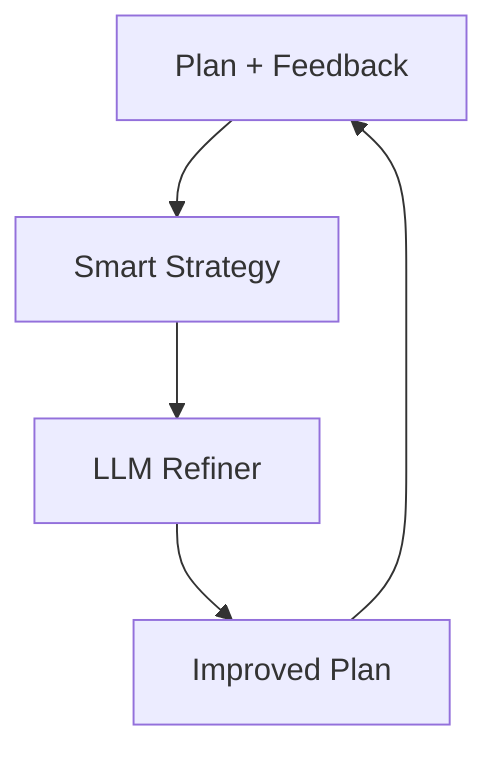

# Sovereign Refinement Coordinator

## Summary
Manages the Iterative Cycle Refinement (ICR) loop. it takes feedback from gauntlets or human reviewers and coordinates the necessary changes to the decomposition plan to resolve identified issues.

## Core Flow

## Notable Gotchas & Tech Debt
- **Loop Stagnation**: LLMs can sometimes get stuck in a "refinement loop" where they repeat the same suggestions without real improvement.
- **Fatigue Score**: The system uses a "fatigue score" to reset model temperature or change strategies if progress stalls.

[[sovereign_system.md]]
