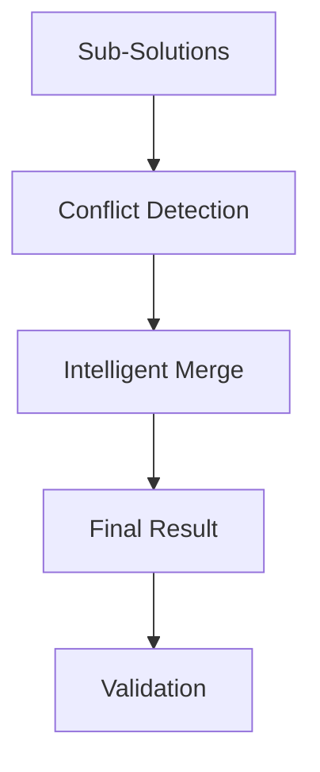

# Sovereign Solution Orchestration

## Summary
The final stage of the Sovereign workflow. it tracks the progress of individual sub-problem solutions, detects semantic or logical conflicts between them, and uses intelligent merging to synthesize the final unified result.

## Core Flow

## Notable Gotchas & Tech Debt
- **Merge Conflicts**: Standard text concatenation is avoided; however, even with LLM-based merging, conflicting logical assumptions between sub-solutions can be difficult to reconcile.
- **Synthesis Bottleneck**: Reassembling many complex sub-solutions into a single coherent output can exceed the context window or reasoning capacity of some models.

[[sovereign_system.md]]
