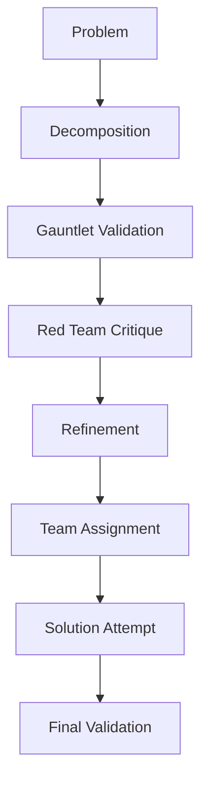

# Sovereign System

## Summary
The Sovereign System is a "high-reliability" orchestration layer designed for critical tasks. It adds rigorous validation "Gauntlets" (Coherence, Completeness, Feasibility) to the decomposition process and coordinates specialized Red Team (attackers), Blue Team (defenders), and Gold Team (evaluators) to refine solutions.

## Core Flow

## Notable Gotchas & Tech Debt
- **Gauntlet Overhead**: Running multiple LLM-based gauntlets for every decomposition step significantly increases latency and token costs.
- **Complexity of Handoffs**: The interaction between Red Team feedback and the `RefinementCoordinator` involves complex logic for prioritizing and applying improvements.
- **Database Reliance**: Heavily dependent on the `SovereignDatabase` for persistence, which must stay in sync with the overall workflow state.

[[run_me.md]]
