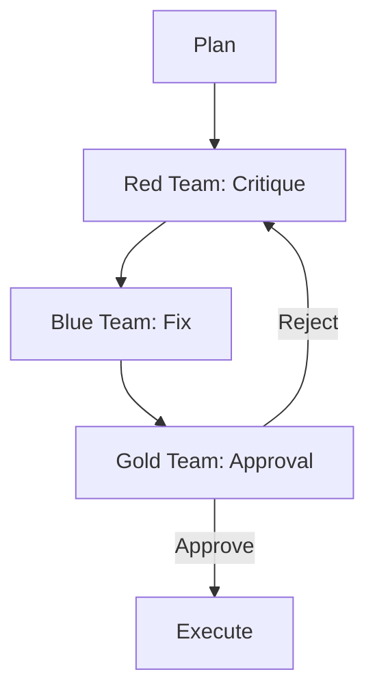

# Sovereign Multi-Agent Team Coordination

## Summary
Implements an adversarial quality control workflow by pitting specialized teams against each other. The **Red Team** critiques the plan; the **Blue Team** fixes findings; and the **Gold Team** (Evaluator) provides final approval.

## Core Flow

## Notable Gotchas & Tech Debt
- **Approval Deadlocks**: A "Critical" Red Team finding can block the Gold Team indefinitely if the Blue Team is unable to find a satisfactory resolution.
- **Role Overlap**: Some agents struggle to maintain the strict distinction between "attacking" (Red) and "defending" (Blue).

[[sovereign_system.md]]
